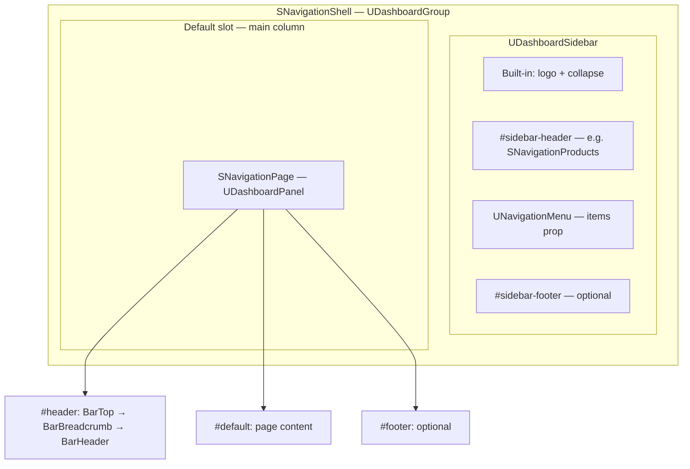

# Navigation

This layer provides a **sidebar + main panel** layout aligned with the Smartness dashboard pattern. The system is fully modular: you compose it from individual components and only include the pieces you need.

---

## How it works

### Big picture

Navigation is built on Nuxt UI’s **dashboard** primitives. **`SNavigationShell`** renders a `UDashboardGroup`: a **collapsible sidebar** (logo, collapse control, your sidebar header content, vertical nav menu, optional footer) plus a **default slot** for the main workspace. You put **`SNavigationPage`** in that default slot so the main area is a `UDashboardPanel` (header region + scrollable body + optional footer).

Nothing in the shell decides which “header rows” your app has beyond the sidebar. All top-of-content chrome (**top bar**, **breadcrumb**, **page header**) is **opt-in**: you add `SNavigationBarTop`, `SNavigationBarBreadcrumb`, and/or `SNavigationBarHeader` inside **`SNavigationPage`’s `#header` slot**, in order, and skip any piece you do not need.



### Dashboard context and mobile sidebar

**`SNavigationBarTop`** uses **`useDashboard()`** to open/close the mobile drawer and to read whether the sidebar is open. That composable is wired by **`UDashboardGroup`**, which **`SNavigationShell`** already provides. Therefore **`SNavigationPage` must stay inside the same `SNavigationShell` tree** (as in the example below). If you mount the top bar outside that tree, the logo toggle will not be able to control the drawer.

On **small viewports**, the **Smartness icon** in the top bar toggles the sidebar full-screen (Nuxt UI behavior). On **`lg` and up**, that control is hidden; collapse/expansion uses the control next to the full logo in the sidebar header.

### Sidebar: what you control

| Area | Who owns it |
| --- | --- |
| Logo + collapse | Built into **`SNavigationShell`** (Nuxt UI sidebar header) |
| Above the nav list | **`#sidebar-header`**, e.g. **`SNavigationProducts`** with `v-model` and `:collapsed` from the slot props |
| Nav links | **`items`** on the shell (**`NavigationMenuItem[]`** or grouped **`[][]`**) |
| Below the nav list | **`#sidebar-footer`** |

The shell does **not** include a product switcher by default; you add **`SNavigationProducts`** (or your own UI) in **`#sidebar-header`** so switching logic stays explicit.

### Main column: three optional bars

Inside **`SNavigationPage` `#header`**, the usual stack is:

1. **`SNavigationBarTop`** — Product-wide actions (CTA, make-a-wish, help, user), plus **optional `#left`**. This is the row that contains the **mobile drawer toggle** on the left.
2. **`SNavigationBarBreadcrumb`** — Breadcrumbs; optional **`#right`**. Omit the component if you do not want this row.
3. **`SNavigationBarHeader`** — Page title, back, optional “How does it work”, **`#actions`**, and optional tabs. Omit the component if the route does not need this block.

Order matters: they stack top to bottom as **separate bordered rows**, matching the Figma-style dashboard header.

### Responsiveness (page header row)

**`SNavigationBarHeader`** lays out **title + optional how-it-works** on one cluster; **actions** wrap on a **second row on small screens** and align to the **trailing edge on large screens**. Tabs render under that block when **`tabs`** is set. **`SNavigationBarTop`** keeps actions in a horizontal cluster (with optional **`#default`** replacing the whole cluster).

### State and persistence

- Sidebar **collapsed** / **open** (drawer) can be bound with **`v-model:collapsed`** and **`v-model:open`** on **`SNavigationShell`** when you need control.
- The shell’s group uses **`storage-key="smartness-navigation"`** so collapse preference can persist (Nuxt UI / local storage, depending on setup).

### Adopting this in your app (short checklist)

1. Wrap your logged-in layout with **`SNavigationShell`** and pass **`items`** for **`UNavigationMenu`**.
2. Optionally fill **`#sidebar-header`** (e.g. **`SNavigationProducts`**) and **`#sidebar-footer`**.
3. Place **`SNavigationPage`** in the shell’s default slot; put **`SNavigationBarTop`**, **`SNavigationBarBreadcrumb`**, **`SNavigationBarHeader`** in **`#header`** only where needed.
4. Use **`@cta`**, **`@help-center`**, etc. on the top bar and **`@back`**, **`@tab-change`**, **`@how-does-it-work`** on the header for page-level handlers.
5. Override visuals with each component’s **`ui`** prop where needed (same idea as Nuxt UI **`ui`** overrides).

The playground’s **`.playground/app/layouts/default.vue`** is the canonical end-to-end example.

---

## Components overview

| Component | Purpose |
| --- | --- |
| **`SNavigationShell`** | Sidebar rail (logo, collapse, nav menu) + page area |
| **`SNavigationPage`** | Main content panel (`UDashboardPanel` wrapper) with `#header`, default body, `#footer` |
| **`SNavigationBarTop`** | Top bar with mobile sidebar toggle, optional `#left`, and shared actions (CTA, make-a-wish, help, user) |
| **`SNavigationBarBreadcrumb`** | Breadcrumb row |
| **`SNavigationBarHeader`** | Title / back / "How does it work" / tabs / actions row |
| **`SNavigationProducts`** | Product select / collapsed menu; placed in `SNavigationShell`'s `#sidebar-header` slot by the consumer |

All custom components accept a **`ui`** prop (object of CSS class strings keyed by slot name) so consumers can override default styling, following the same pattern as Nuxt UI.

---

## Composition

`SNavigationPage` must be rendered **inside** the same `UDashboardGroup` tree as the shell (typically as the default child of `SNavigationShell`) so the mobile sidebar toggle can call `useDashboard()` correctly.

```vue
<template>
  <SNavigationShell :items="navigationItems">
    <template #sidebar-header="{ collapsed }">
      <SNavigationProducts
        v-model="currentProduct"
        :products="products"
        :collapsed="collapsed"
      />
    </template>

    <SNavigationPage>
      <template #header>
        <SNavigationBarTop
          :user="{ dropdown: { items: userMenuItems } }"
          @cta="onCta"
        />
        <SNavigationBarBreadcrumb
          :items="[{ label: 'Home', to: '/' }, { label: 'Calendar' }]"
        />
        <SNavigationBarHeader
          title="Calendar"
          back-label="Back"
          show-how-does-it-work
          :tabs="tabs"
          :active-tab="activeTab"
          @back="router.back()"
          @how-does-it-work="onGuide"
          @tab-change="onTab"
        >
          <template #actions>
            <UButton label="Primary action" />
          </template>
        </SNavigationBarHeader>
      </template>

      <UContainer>
        <NuxtPage />
      </UContainer>
    </SNavigationPage>
  </SNavigationShell>
</template>
```

Reference implementation: `.playground/app/layouts/default.vue`.

---

## SNavigationShell

| Concern | Details |
| --- | --- |
| **Props** | `items: NavigationMenuItem[] \| NavigationMenuItem[][]` |
| **v-models** | `collapsed`, `open` (sidebar drawer on small screens) |
| **Slots** | `#sidebar-header` (receives `{ collapsed }`; place `SNavigationProducts` here), `#sidebar-footer` (receives `{ collapsed }`) |
| **`ui` slots** | `root`, `sidebar`, `sidebarHeader` |
| **Persistence** | Collapse/open state uses `storage-key="smartness-navigation"` on the underlying `UDashboardGroup` |

`items` follows Nuxt UI's navigation menu shape. Use a **2D array** to separate groups (e.g. main links vs. footer links).

---

## SNavigationPage

Thin wrapper around `UDashboardPanel`. The user composes the header by placing bar components in the `#header` slot.

| Concern | Details |
| --- | --- |
| **Props** | `panelProps?` (forwarded to `UDashboardPanel`) |
| **Slots** | `#header`, `#default` (body), `#footer` |
| **`ui` slots** | `root`, `body` |

---

## SNavigationBarTop

Always visible when placed. Contains the mobile sidebar toggle (Smartness logo icon), optional `#left`, and the shared actions row (or a custom `#default` replacing the whole actions area).

| Concern | Details |
| --- | --- |
| **Props** | `cta?`, `makeAWish?`, `helpCenter?`, `helpCenterText?`, `user?` |
| **Emits** | `cta`, `makeAWish`, `helpCenter`, `user` |
| **Slots** | `#left`; `#default` (entire actions cluster); `#cta`, `#makeAWish`, `#helpCenter`, `#user` (override one control while keeping the default cluster) |
| **`ui` slots** | `root`, `left` |

---

## SNavigationBarBreadcrumb

Simple breadcrumb row. Omit the component entirely if you don't need breadcrumbs.

| Concern | Details |
| --- | --- |
| **Props** | `items?: BreadcrumbItem[]` |
| **Slots** | `#left` (overrides `UBreadcrumb`), `#right` |
| **`ui` slots** | `root` |

---

## SNavigationBarHeader

Title bar with optional back button, "How does it work" control, secondary actions, and tabs. Omit entirely if you don't need a header row.

| Concern | Details |
| --- | --- |
| **Props** | `title?`, `backLabel?`, `showHowDoesItWork?`, `howDoesItWorkButton?` (`ButtonProps`), `tabs?: TabsItem[]`, `activeTab?: string \| number` |
| **Emits** | `back`, `howDoesItWork`, `tabChange` |
| **Slots** | `#title`, `#actions` |
| **`ui` slots** | `root`, `titleRow`, `titleGroup`, `title`, `actions`, `tabs` |

**How does it work:** Enable with `show-how-does-it-work`. Click emits `@how-does-it-work`. Default label comes from locale `sAppPage.howDoesItWorkLabel`; override with `how-does-it-work-button`. Below `md` only the icon is shown; from `md` upward icon + label are shown.

**Title:** Uses `line-clamp-2` on smaller screens and `lg:truncate` on desktop. When the how-does-it-work button is present, the title shrinks to fit beside it.

**Actions (`#actions`):** On `max-lg` they render on a second row under the title. On `lg+` they sit on the same row, aligned to the end.

**Tabs:** `UTabs` with `color="secondary"`, `variant="link"`, `size="md"`, `content={false}`.

---

## SNavigationProducts

Product switcher: `USelect` when the sidebar is expanded, `UDropdownMenu` + icon button when collapsed. Labels use a two-tone “Smart” + product name treatment matching suite labels in `app/types/suite.ts`.

| Concern | Details |
| --- | --- |
| **Props** | `products: SuiteProduct[]` (owned products; others appear under “Recommended for you”), `collapsed?` |
| **v-model** | `SuiteProduct` |

---

## Localization

- Sidebar toggle: Nuxt UI's `dashboardSidebarToggle.open` / `dashboardSidebarToggle.close`
- Top bar CTA: `sTopBar.ctaLabel` (used inside `SNavigationBarTop`)
- How does it work: `sAppPage.howDoesItWorkLabel`

See [locale-guide.md](./locale-guide.md) for extending messages.
